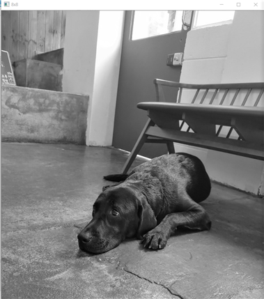

# DCT Lossy Compression

# 1. Theory
## ● DCT Lossy Compression
이미지의 압축을 위한 방법입니다.
* 압축 순서
  1. 2D DCT에 사용될 8x8 DCT basis를 구한다.
  2. 입력 영상을 read 하여 graylevel로 변환한다.
  3. 이미지의 8x8 영역 f(i,j)를 8x8 DCT basis를 이용하여 주파수공간 8x8 F(u,v)로 변환한다.
## ● IDCT
DCT 방식으로 압축된 이미지를 원래 이미지로 되돌리는 작업입니다.
* IDCT는 DCT 압축 순서의 역순입니다.

# 2. Code
## 함수 : Mat* DCTcompression(Mat& image)
DCT 압축을 위한 함수입니다. 압축 결과를 Mat* 형태로 반환합니다.
1. ( line 45 ~ 65 )
전체 이미지를 8x8씩 잘라서 각각 DCT를 적용합니다.
```c
for (int y = 0; y < image.rows; y += 8) {
			for (int x = 0; x < image.cols; x += 8) {

				for (int v = y; v < y + 8; v++) { // 8*8 DCT
					out_ptr = out->ptr<double>(v);
					for (int u = x; u < x + 8; u++) {

						double temp = 0;
						for (int j = y; j < y + 8; j++) { // F(u,v) 하나 얻음
							image_ptr = image.ptr<uchar>(j);
							for (int i = x; i < x + 8; i++) {
								temp += DCTbasis(u - x, v - y, i - x, j - y)*image_ptr[i]; // DCTbasis는 인자값이 0~7까지의 값이므로 그에 맞게 넣어줌
							}
						}

						out_ptr[u] = temp;

					}
				}
			}
		}
```
## 함수 : Mat* IDCTcompression(Mat& image, int compression_ratio)
DCT 방식으로 압축된 이미지를 원 이미지로 만듭니다.
* 인자
  * image : 압축된 입력 이미지
  * compression_ratio : 압축된 이미지 8x8 F(u,v) 중 compression_ratio x compression_ratio 만큼만 사용하여 압축을 해제합니다.  
  (1~8 숫자가 낮을수록 복원된 이미지가 원본과 다름)
1. ( line 84 ~ 105 )
DCT와 마찬가지로 8x8씩 끊어서 compression_ratio에 맞는 IDCT를 적용합니다. 
```c
for (int y = 0; y < image.rows; y += 8) {
			for (int x = 0; x < image.cols; x += 8) {

				for (int j = y; j < y + 8; j++) {
					out_ptr = out->ptr<uchar>(j);
					for (int i = x; i < x + 8; i++) { // 8*8 IDCT

						double temp = 0;
						for (int v = y; v < y + compression_ratio; v++) {
							image_ptr = image.ptr<double>(v);
							for (int u = x; u < x + compression_ratio; u++) {


								temp += DCTbasis(u - x, v - y, i - x, j - y)*image_ptr[u];
							}
						}

						out_ptr[i] = floor(temp + 0.5); // 계산오차를 보정하기위한 반올림
					}
				}
			}
		}
```
## 함수 : double DCTbasis(int u, int v, int i, int j)
DCT 연산에 필요한 basis function을 계산하는 함수입니다. 

# 3. Result
원본 이미지를 압축하고 압축한 결과 F(u,v)를  
1. 8x8 그대로 압축 해제
2. 좌상단 4x4 만 남기고 0으로 바꾼후 압축 해제
3. 좌상단 2x2 만 남기고 0으로 바꾼후 압축 해제

3가지의 방법으로 하나의 이미지를 압축해제해봤습니다.  
F(u,v)를 손실시킬수록 압축해제된 이미지는 원본과 달라집니다. 


<h2>● Original Image</h2>

<p>F(u,v) 그대로 사용</p>
<p>원본 이미지와 완벽히 동일하게 복구되었습니다.</p>

<h2>● 8x8 F(u,v) Image</h2>

<p>F(u,v) 8x8 그대로 압축 해제</p>
<p>원본과 완벽히 일치합니다.</p>

<h2>● 4x4 F(u,v) Image</h2>

<p>F(u,v) 좌상단 4x4 만 남기고 0으로 바꾼후 압축 해제</p>
<p>일부가 손실되었습니다.</p>

<h2>● 2x2 F(u,v) Image</h2>

<p>F(u,v) 좌상단 2x2 만 남기고 0으로 바꾼후 압축 해제</p>
<p>원본과 비교하여 많이 손실되었습니다.</p>

