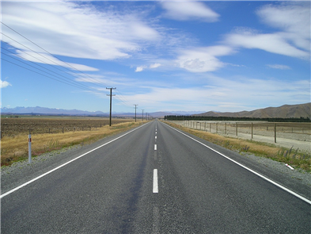
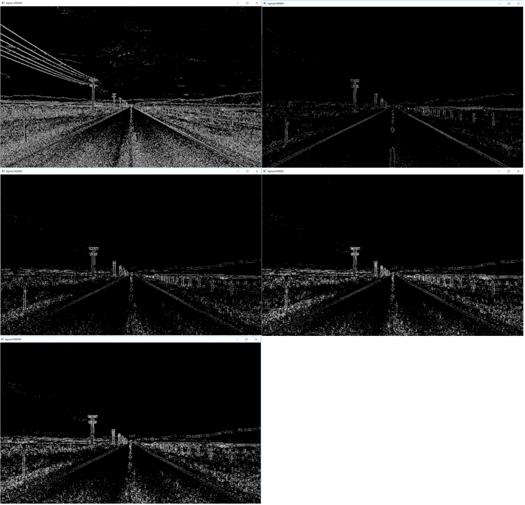

# Laplacian Of Gaussian
이미지에서 경계를 찾는 method를 사용해봅니다.

# 1. Theory
## Laplacian Of Gaussian(LoG)
Gaussian blur와 Laplacian filter 합친 용어.
Laplacian filter를 사용하기 위해서는 Gaussian blur를 이미지에 먼저 적용시켜야 효과적입니다.
## Laplacian filter
이미지에서 경계를 찾아내는 방법(edge detection) 중 하나입니다.
## Gaussian blur
이미지를 smoothing(경계를 흐릿하게 만듦)하는 방법입니다.
## zero crossing
이미지의 픽셀값이 0인 부분만 gray scale를 최대로 주고 나머지 부분은 모두 scale을 0으로 주는 방법입니다.
LoG 이후 zero crossing을 해주어야 경계가 뚜렷히 보입니다. 

# 2. Code 

## void makeLogZero(Mat& input, Size size, double sigma)
Laplacian Of Gaussian을 사용하고 zero crossing까지 마친 결과를 윈도우에 띄우는 동시에 파일로 저장합니다.
1. ( line 36 ~ 42 )
LoG를 사용하고 zero croosing까지 수행하는 핵심 부분입니다.
```c
	GaussianBlur(input, input2, size, sigma, 0.0, BORDER_DEFAULT);
	cvtColor(input2, gray_img, COLOR_BGR2GRAY); // grayscale로 바꿔줌	

	Laplacian(gray_img, laplac_img, CV_32F, 3, 1, 0, BORDER_DEFAULT); // 결과값이 256을 넘고
																	  //zeroCrossing함수가 float 형태를 받으므로 CV_32F를 사용

	FindZeroCrossings(laplac_img, zero_img); // 결과값이 unsigned char 형태로 출력되므로 0~255까지 값이 나옴
```

## void FindZeroCrossings(Mat& laplacian, Mat& zero_crossings)
zero crossing을 찾아내 이미지에 출력해주는 함수입니다. 결과는 인자인 Mat& zero_crossings 에 저장됩니다.
1. ( line 60 ~ 84 )
```c
float laplacian_threshold = 20.0; // 쓰레시 홀드 20을 사용
									  // Find Zero Crossings
	for (int row = 1; row < image_rows; row++) {
		float* prev_row_pixel = laplacian.ptr<float>(row - 1) + 1;
		float* curr_row_pixel = laplacian.ptr<float>(row);
		uchar* output_pixel = zero_crossings.ptr<uchar>(row) + 1;
		for (int column = 1; column < values_on_each_row; column++)
		{
			float prev_value_on_row = *curr_row_pixel;
			curr_row_pixel++;
			float curr_value = *curr_row_pixel;
			float prev_value_on_column = *prev_row_pixel;
			float difference = 0.0;
			if (((curr_value > 0) && (prev_value_on_row < 0)) ||
				((curr_value < 0) && (prev_value_on_row > 0)))
				difference = abs(curr_value - prev_value_on_row);
			if ((((curr_value > 0) && (prev_value_on_column < 0)) ||
				((curr_value < 0) && (prev_value_on_column > 0))) &&
				(abs(curr_value - prev_value_on_column) > difference))
				difference = abs(curr_value - prev_value_on_column);
			*output_pixel = (difference > laplacian_threshold) ? 255 : 0;// (int) ((100 * difference) / laplacian_threshold);
			prev_row_pixel++;
			output_pixel++;
		}
	}
```

# 3. Result
Gaussian blur의 인자인 sigma를 증가시킬수록 smoothing이 더 크게 일어납니다.
sigma를 1~5까지 변화시키며 결과를 테스트했습니다.
<h2>Original image</h2>

<h2>Apply LoG</h2>



